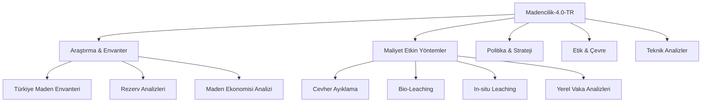

# ⛏️ Madencilik-4.0-TR: Türkiye Maden Araştırmaları ve Strateji Portalı

**Türkiye'nin yer altı zenginliklerini, modern çıkarma yöntemlerini ve madencilik ekonomisini veriye dayalı araştırmalarla inceleyen akademik düzeyde bir dijital külliyat.**

---

  
  
  
  

---

## 📖 Giriş: Projenin Amacı ve Kapsamı

**Madencilik-4.0-TR**, geleneksel madencilik pratiklerinin dijital dönüşüm (Mining 4.0) ve sürdürülebilirlik ilkeleriyle yeniden yorumlandığı bir **araştırma portalıdır.** Bu platform, Türkiye'deki maden yataklarının jeolojik potansiyelini, maliyet etkin çıkarma teknolojilerini ve küresel piyasalardaki stratejik konumunu bilimsel bir perspektifle ele almaktadır.

Amacımız; jeoloji mühendislerinden yatırımcılara, akademisyenlerden politika yapıcılara kadar tüm paydaşlar için derinlikli, güncel ve açık kaynaklı bir referans kütüphanesi oluşturmaktır.

---

## 📂 Araştırma Modülleri ve Mimari

Proje, madencilik sektörünün tüm dikey bileşenlerini kapsayan 12 ana araştırma katmanından oluşmaktadır:

### 🔍 Öne Çıkan Araştırma Dosyaları

- 🗺️ **Türkiye Maden Envanteri:** [Bölgesel Rezerv ve Yatak Analizleri](arastirma-ve-inovasyon/turkiye-maden-envanteri.md).
- 📈 **Maden Ekonomisi:** [Küresel Emtia Piyasaları ve Türkiye](arastirma-ve-inovasyon/maden-ekonomisi-analizi.md).
- 💰 **Maliyet Etkin Çıkarma:** [Modern ve Verimli Maden Çıkarma Yöntemleri](teknolojiler/maliyet-etkin-cikarma-yontemleri.md).
- 🇹🇷 **Yerel Başarı Hikayeleri:** [Elazığ Bakır ve Sivas Altın Keşif Analizleri](vaka-analizleri/yerel-maden-analizleri.md).
- 📜 **Vizyon 2030:** [Türkiye'nin Gelecek Madencilik Stratejisi](dokumantasyon/manifesto.md).
- 📊 **Ekonomik Veri:** [NTE Fiyat Endeksi](verisetleri/nadir-toprak-elementleri/nte_fiyat_endeksi.json) ve [Yeni Keşifler 2024](verisetleri/stratejik-metaller/yeni_kesifler_2024.json).

---

## 🛠️ Teknolojik ve Metodolojik Odak Alanları

Bu portalda ele alınan maliyet etkin çıkarma yöntemleri, birim maliyeti düşürürken operasyonel verimliliği maksimize etmeyi hedefler:

1.  **Cevher Ayıklama (Ore Sorting):** XRT (X-Ray) ve NIR teknolojileriyle atık kayanın değirmene girmeden önce ayıklanması.
2.  **Biyohidrometalurji (Bio-Leaching):** Düşük tenörlü veya karmaşık cevherlerin mikroorganizmalar yardımıyla ekonomiye kazandırılması.
3.  **Yerinde Çözeltme (In-Situ Leaching):** Yüzey tahribatını minimize eden, CAPEX dostu sıvı çıkarma teknolojisi.
4.  **Dijital İkiz ve Veri Analitiği:** Maden sahalarının dijital ikizleri üzerinden enerji ve iş gücü optimizasyonu.

---

## 💎 Stratejik Maden Portföyü ve Türkiye Analizi

| Maden Grubu | Küresel Rezerv Payı | Stratejik Rol | Araştırma Dosyası |
|:---|:---:|:---|:---|
| **Bor Mineralleri** | %73 | Enerji, Nükleer, Savunma | [Bor Stratejisi](verisetleri/stratejik-metaller/bor_istatistikleri.json) |
| **NTE (Rare Earth)** | Dünya 2.si | Yeşil Teknoloji, EV, Çip | [Beylikova Raporu](verisetleri/nadir-toprak-elementleri/nte_rezervleri_turkiye.md) |
| **Bakır (Cu)** | Artan Potansiyel | Elektrifikasyon, Yenilenebilir | [Bakır Analizi](vaka-analizleri/yerel-maden-analizleri.md) |
| **Altın (Au)** | ~6500 Ton Potansiyel | Finansal Güvence, Cari Açık | [Altın Envanteri](arastirma-ve-inovasyon/turkiye-maden-envanteri.md) |

---

## 🔭 Sektörel Görünüm 2025-2030 Projeksiyonu

Türkiye madencilik sektörü için önümüzdeki 5 yılın ana trendleri:
- **Katma Değerli İhracat:** Ham cevher yerine uç ürün (bor karbür, bakır tel vb.) ihracatına odaklanma.
- **Kritik Hammadde Yasası (CRMA) Uyumu:** AB pazarı için izlenebilir ve etik madencilik sertifikasyonu.
- **Derin Deniz ve Otonom Madencilik:** Yeni sınırların keşfi ve yerli robotik sistemlerin entegrasyonu.

---

## 🤝 Katkıda Bulunma ve Akademik İş Birliği

Bu portal, kolektif bir araştırma topluluğudur. Aşağıdaki alanlarda katkı sağlayabilirsiniz:
- Yeni maden yataklarına dair saha verileri ve jeolojik raporlar.
- Maliyet analizleri ve teknolojik uygulama vaka çalışmaları.
- Sektörel yasal mevzuat incelemeleri ve politika önerileri.

---

## ❓ Sıkça Sorulan Sorular (SSS)

**S: Veriler hangi kaynaklara dayanmaktadır?**
C: İçerikler; MTA, MAPEG, USGS ve ilgili şirketlerin (Eti Maden, Eti Bakır vb.) resmi raporları ile akademik literatür taramalarına dayanmaktadır.

**S: İçeriği ticari veya akademik projelerimde kullanabilir miyim?**
C: Evet, projemiz MIT Lisansı altındadır. Kaynak göstererek (Atıf yaparak) dilediğiniz gibi kullanabilirsiniz.

---

## 📜 Lisans ve Atıf

Bu proje [MIT Lisansı](LICENSE) ile korunmaktadır. Akademik çalışmalarınızda aşağıdaki şekilde atıf yapabilirsiniz:

> *Madencilik-4.0-TR (2025). Türkiye Maden Envanteri ve Maliyet Etkin Çıkarma Teknolojileri Araştırma Portalı.*

---

  <b>Türkiye'nin yer altı zenginliklerini bilgiyle işliyoruz.</b> 
  <i>"Gelecek, toprağın altındaki cevheri aklın ışığıyla birleştirenlerindir."</i>

