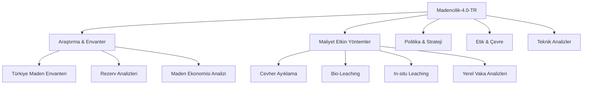

# ⛏️ Madencilik-4.0-TR: Türkiye Maden Araştırmaları ve Strateji Portalı

**Türkiye'nin yer altı zenginliklerini, modern çıkarma yöntemlerini ve madencilik ekonomisini veriye dayalı araştırmalarla inceleyen akademik düzeyde bir dijital külliyat.**

---

  
  
  
  

---

## 📖 Projenin Amacı ve Kapsamı

**Madencilik-4.0-TR**, bir yazılım deposu olmanın ötesinde; Türkiye'deki maden yataklarının jeolojik potansiyelini, maliyet etkin çıkarma teknolojilerini ve sektörel gelecek vizyonunu bir araya getiren kapsamlı bir **araştırma portalıdır.** 

Amacımız; jeoloji mühendislerinden yatırımcılara, akademisyenlerden politika yapıcılara kadar tüm paydaşlar için derinlikli, güncel ve bilimsel bir referans kaynağı oluşturmaktır.

---

## 📂 Araştırma Modülleri ve İçerik

Proje, madenciliğin her boyutunu ele alan 12 ana araştırma katmanından oluşmaktadır:

### 🔍 Öne Çıkan Araştırma Dosyaları

- 🗺️ **Türkiye Maden Envanteri:** [Bölgesel Rezerv ve Yatak Analizleri](arastirma-ve-inovasyon/turkiye-maden-envanteri.md).
- 📈 **Maden Ekonomisi:** [Küresel Emtia Piyasaları ve Türkiye](arastirma-ve-inovasyon/maden-ekonomisi-analizi.md).
- 💰 **Maliyet Etkin Çıkarma:** [Modern ve Verimli Maden Çıkarma Yöntemleri](teknolojiler/maliyet-etkin-cikarma-yontemleri.md).
- 🇹🇷 **Yerel Başarı Hikayeleri:** [Elazığ Bakır ve Sivas Altın Keşif Analizleri](vaka-analizleri/yerel-maden-analizleri.md).
- 📜 **Vizyon 2030:** [Türkiye'nin Gelecek Madencilik Stratejisi](dokumantasyon/manifesto.md).
- 📊 **Ekonomik Veri:** [NTE Fiyat Endeksi](verisetleri/nadir-toprak-elementleri/nte_fiyat_endeksi.json) ve [Yeni Keşifler 2024](verisetleri/stratejik-metaller/yeni_kesifler_2024.json).

---

## 🛠️ İncelenen Teknolojik Yöntemler (Methodologies)

Bu portalda ele alınan maliyet etkin yöntemler, operasyonel verimliliği maksimize etmeyi hedefler:

1.  **Cevher Ayıklama (Ore Sorting):** XRT ve NIR teknolojileriyle atık kayanın tesise girmeden elenmesi.
2.  **Biyohidrometalurji:** Düşük tenörlü cevherlerin bakteriyel oksidasyon ile ekonomiye kazandırılması.
3.  **Yerinde Çözeltme (ISL):** Minimum yüzey tahribatı ve düşük CAPEX ile maden çıkarma.
4.  **Hidrojen Yakıtlı Filolar:** Maden sahalarında karbon ayak izini sıfırlayan enerji dönüşümü.

---

## 💎 Stratejik Odak Madenler

| Maden Grubu | Türkiye'deki Önemi | Araştırma Dosyası |
|:---|:---|:---|
| **Bor Mineralleri** | Dünya rezervinin %73'ü | [Bor Strateji Raporu](verisetleri/stratejik-metaller/bor_istatistikleri.json) |
| **NTE (Rare Earth)** | Dünyanın en büyük 2. rezervi | [Beylikova Rezerv Analizi](verisetleri/nadir-toprak-elementleri/nte_rezervleri_turkiye.md) |
| **Bakır ve Altın** | Stratejik ihracat ve sanayi ham maddesi | [Metalik Maden Envanteri](arastirma-ve-inovasyon/turkiye-maden-envanteri.md) |

---

## 🤝 Katkıda Bulunma

Bu bir açık kaynaklı araştırma topluluğudur. Akademik çalışmalarınızı, vaka analizlerinizi veya teknik verilerinizi paylaşarak bu külliyatın gelişmesine katkıda bulunabilirsiniz.

---

## 📜 Lisans ve Atıf

Bu proje [MIT Lisansı](LICENSE) ile korunmaktadır. Akademik çalışmalarınızda aşağıdaki şekilde atıf yapabilirsiniz:

> *Madencilik-4.0-TR (2025). Türkiye Maden Envanteri ve Maliyet Etkin Çıkarma Teknolojileri Araştırma Portalı.*

---

  <b>Türkiye'nin yer altı zenginliklerini bilgiyle işliyoruz.</b>

