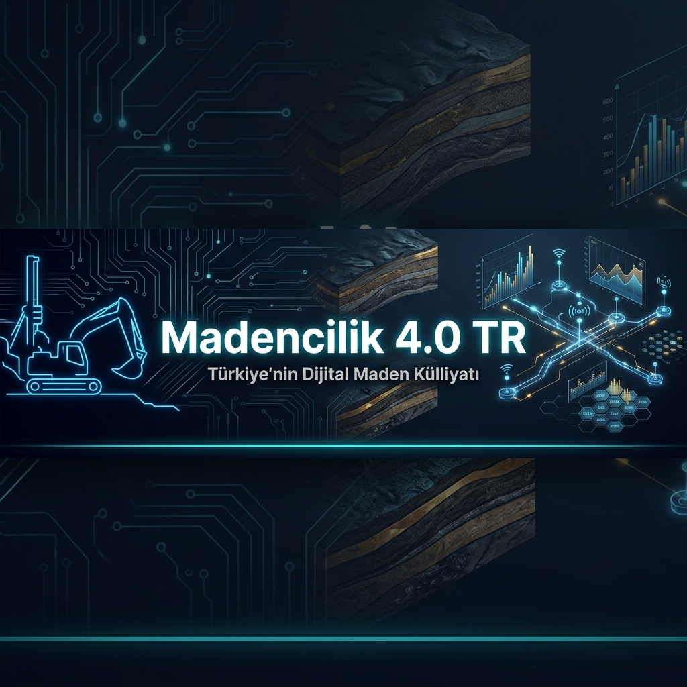
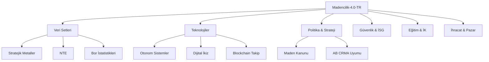

# ⛏️ Madencilik-4.0-TR: Yeni Nesil Dijital Maden Külliyatı

**Türkiye'nin yeraltı kaynaklarını veri bilimi, otonom sistemler ve yapay zeka ile geleceğe taşıyan en kapsamlı açık kaynaklı strateji ve teknoloji portalı.**

---

<p align="center">
  
  
  
  
  
</p>

---

## 🌟 Neden Madencilik 4.0?

Geleneksel madencilik, yerini **veri odaklı**, **otonom** ve **düşük karbon ayak izine** sahip yeni bir endüstriyel devrime bırakıyor. **Madencilik-4.0-TR**, bu dönüşümün Türkiye ayağındaki teknolojik, yasal ve ekonomik eksiklikleri gidermek amacıyla inşa edilmiştir.

*   **Veri Madenciliği:** Jeolojik verileri sadece saklamıyor, otonom kararlar için işliyoruz.
*   **Stratejik Güvenlik:** Nadir Toprak Elementleri (NTE) ve Bor gibi kritik madenlerde teknolojik tam bağımsızlığı hedefliyoruz.
*   **İnsan Odaklı Dönüşüm:** Tehlikeli işleri robotlara bırakırken, insan kaynağını dijital yetkinliklerle donatıyoruz.

---

## 🚀 Öne Çıkan Özellikler

- 📊 **Zengin Veri Setleri:** Altın, Bor, Bakır ve NTE üzerine yapılandırılmış JSON/GeoJSON verileri.
- 🤖 **Teknolojik Derinlik:** Dijital İkiz, IoT, Otonom Filo ve Hidrometalurji analizleri.
- 🖥️ **Interaktif Dashboard:** [Madencilik 4.0 Komuta Kontrol Merkezi](dashboard/index.html) (Gerçek zamanlı simülasyon).
- 📜 **Manifesto:** [Gelecek Vizyonu ve Motivasyon](dokumantasyon/manifesto.md).
- 🚀 **Vizyon 5.0:** [Geleceğin Madencilik Yol Haritası](dokumantasyon/madencilik-5-0-vizyonu.md).
- ⚖️ **Politika ve Strateji:** AB Kritik Hammadde Yasası (CRMA) ve Maden Kanunu üzerine akademik incelemeler.
- 🚑 **0 Kaza Vizyonu:** Yeraltı güvenlik sistemleri ve dijital acil müdahale planları.
- 🗺️ **Interaktif Haritalama:** Python tabanlı mekansal analiz ve görselleştirme araçları.

---

## 📂 Proje Mimarisi ve Modüller

Proje, 11 ana modülden ve kapsamlı bir dokümantasyon katmanından oluşmaktadır:



<details>
<summary><b>🔍 Detaylı Dosya Yapısını Görüntüle</b></summary>

```text
Madencilik-4.0-TR/
├── verisetleri/                # JSON/CSV Rezerv ve Üretim Verileri
├── teknolojiler/               # Teknik Analiz ve Uygulama Rehberleri
├── maliyet-analizi/            # CAPEX/OPEX ve ROI Modelleri
├── haritalama/                 # GIS Araçları ve GeoJSON Verileri
├── vaka-analizleri/            # Küresel ve Yerel Başarı Örnekleri
├── etik-ve-cevre/              # ESG ve Karbon Ayak İzi Hesaplama
├── politika-ve-strateji/       # Yasal Analizler ve Ulusal Vizyon
├── guvenlik-ve-is-sagligi/     # Dijital Güvenlik ve 0 Kaza Hedefi
├── egitim-ve-insan-kaynagi/    # Yetkinlik Dönüşümü ve VR/AR Eğitim
├── arastirma-ve-inovasyon/     # Yerli Teknoloji ve AR-GE Ekosistemi
├── ihracat-ve-pazar/           # Katma Değerli Ticaret Stratejileri
└── dokumantasyon/              # Sözlük ve Akademik Referanslar
```
</details>

---

## 🔭 Sektörel Vizyon 2030: Dijital Eşik

Türkiye madencilik sektörünün 2030 vizyonu, sadece ham madde ihracatçısı olmaktan çıkıp, **yüksek katma değerli uç ürün** ve **maden teknolojisi ihraç eden** bir pozisyona geçmektir.

### Temel Sütunlar:
1.  **Tam Otonom İşletme (Dark Mine):** Yeraltı operasyonlarının %80'inin uzaktan veya otonom sistemlerle yürütülmesi.
2.  **Sıfır Atık & Döngüsel Ekonomi:** Maden atıklarının (tailings) inşaat ve kimya sanayiinde ikincil ham madde olarak %100 kullanımı.
3.  **Bulut Tabanlı Rezerv Yönetimi:** Ulusal maden verilerinin blokzincir güvencesiyle anlık olarak güncellendiği dijital portal.
4.  **Yeşil Enerji Entegrasyonu:** Maden sahalarının enerji ihtiyacının %50+ oranında yerinde yenilenebilir enerji (GES, RES) ile karşılanması.

---

## 💎 Stratejik Maden Portföyü ve Madencilik 4.0 Rolü

| Maden | 4.0 Uygulama Alanı | Stratejik Hedef |
|:---|:---|:---|
| **Bor** | Sensör ve Batarya Teknolojisi | Yüksek saflıkta bor karbür üretimi |
| **NTE** | Daimi Mıknatıslar (EV Motorları) | Yerli ayrıştırma tesisi ve magnet üretimi |
| **Lityum** | Enerji Depolama Sistemleri | Jeotermal kaynaklardan doğrudan ekstraksiyon |
| **Bakır** | Akıllı Şebekeler ve Elektrifikasyon | Verim artışı için AI tabanlı flotasyon |
| **Altın** | Hassas Elektronik ve Uzay Sanayii | Siyanürsüz, çevre dostu hidrometalurji |

---

## 🛠️ Teknolojik Katmanlar (Technical Layers)

### 1. Veri Toplama ve IoT (Sensör Katmanı)
Maden sahasındaki her bir ekipman, havalandırma kanalı ve personel kaskı bir veri düğümüdür (node).
*   **LPWAN (LoRaWAN):** Geniş sahalarda düşük güç tüketimli iletişim.
*   **UWB (Ultra Wide Band):** Santimetre hassasiyetinde personel konumlama.

### 2. Analiz ve Yapay Zeka (Zeka Katmanı)
Toplanan verilerin "anlamlı aksiyonlara" dönüştüğü merkezdir.
*   **Kestirimci Bakım:** Arıza meydana gelmeden 48-72 saat önce tespit.
*   **Jeostatistiksel Modelleme:** Rezerv tahminlerinde %15+ doğruluk artışı.

### 3. Kontrol ve Otonomi (Uygulama Katmanı)
AI kararlarının fiziksel dünyada uygulanmasıdır.
*   **VoD (Ventilation on Demand):** Havalandırmanın sadece ihtiyaç duyulan bölgelerde çalıştırılması ile %40 enerji tasarrufu.
*   **Otonom Delme ve Patlatma:** Hassas patlatma ile sarsıntı ve toz emisyonu kontrolü.

---

## 📈 Kurumsal Dijital Dönüşüm Rehberi

Maden şirketlerinin bu dönüşüme uyum sağlaması için önerilen 5 aşamalı yol haritası:

1.  **Dijital Hazırlık Analizi:** Mevcut altyapının ve veri okuryazarlığının ölçülmesi.
2.  **Veri Omurgasının Kurulması:** Saha genelinde kesintisiz haberleşme (LTE/5G/Fiber) altyapısı.
3.  **Pilot Uygulamalar (PoC):** Belirli bir filoda veya tesis bölümünde otomasyon denemeleri.
4.  **Entegre Operasyon Merkezi (IOC):** Tüm saha verilerinin tek merkezden izlenmesi ve yönetilmesi.
5.  **Ekosistem Entegrasyonu:** Tedarik zinciri ve müşteri portalı ile tam dijital entegrasyon.

---

## 🌿 Sürdürülebilirlik ve Yeşil Madencilik Metrikleri

Madencilik-4.0-TR, çevresel etkiyi minimize etmek için aşağıdaki metrikleri takip eder:

*   **Emisyon Takibi:** Kapsam 1, 2 ve 3 emisyonlarının anlık takibi.
*   **Su Yönetimi:** Proses suyunun %90+ geri kazanımı ve deşarj kalitesi izleme.
*   **Rehabilitasyon Skoru:** Terk edilen sahaların doğaya kazandırılma hızını ölçen uydu tabanlı takip.
*   **Sosyal Lisans Endeksi:** Yerel halkın projeye olan güven ve onay seviyesinin ölçümü.

---

## 🛠️ Teknoloji Yığını (Tech Stack)

| Alan | Kullanılan Teknolojiler / Standartlar |
|:---|:---|
| **Veri İşleme** | Python 3.x, Pandas, Numpy, JSON |
| **GIS / Haritalama** | Folium, Geopandas, GeoJSON, QGIS |
| **Blokzincir** | Smart Contracts, Traceability Protocols |
| **Sürdürülebilirlik** | GHG Protocol, ESG Metrikleri, Tier 2-3 Emisyon Hesaplama |
| **İSG & Güvenlik** | AI Görüntü İşleme, UWB Konumlama, Risk Skoru Algoritmaları |
| **Dokümantasyon** | Markdown, LaTeX (Akademik raporlar için), Mermaid.js |

---

## 📊 Sektörel Görünüm (2024)

| Maden | Küresel Rezerv Payı | İhracat Değeri (USD) | Kullanım Alanı |
|:---|:---:|:---:|:---|
| **Bor** | %72 | 850M+ | Savunma, Cam, Tarım |
| **Mermer** | %35 (Çeşitlilik) | 1.8B | İnşaat, Sanat |
| **Altın** | ~42 Ton/Yıl | — | Finans, Teknoloji |
| **Krom** | Dünya 5. Sıra | 420M | Paslanmaz Çelik |

---

## 🏁 Hızlı Başlangıç: Haritalama

Maden sahalarını interaktif olarak haritalamak için aşağıdaki adımları izleyin:

```bash
# 1. Repoyu klonlayın
git clone https://github.com/arch-yunus/Madencilik-4.0-TR.git

# 2. Bağımlılıkları yükleyin
pip install folium pandas geopandas

# 3. Haritalama scriptini çalıştırın
python haritalama/maden_haritalama.py
```
*Sonuç: `haritalama/maden_haritasi.html` dosyasını tarayıcınızda açın.*

---

## 🗺️ Yol Haritası (Roadmap)

- [x] **Faz 1:** Temel altyapı ve stratejik maden veri setleri.
- [x] **Faz 2:** ESG ve Karbon Ayak İzi hesaplama modülleri.
- [x] **Faz 3:** Yasal analizler ve AB CRMA uyum raporları.
- [x] **Faz 4:** Yapay Zeka tabanlı sismik yorumlama algoritması (BETA).
- [x] **Faz 5:** Web tabanlı interaktif "Maden 4.0 Dashboard" portalı. (TAMAMLANDI 🚀)
- [x] **Faz 6:** Blockchain tabanlı mineral takip prototipi. (TAMAMLANDI 🛠️)
- [ ] **Faz 7:** Küresel maden piyasası için gerçek zamanlı API entegrasyonu.

---

## 🤝 Katkıda Bulunun

Bu proje bir topluluk girişimidir. Jeoloji mühendislerinden yazılımcılara kadar herkesin katkısına açığız.

1.  **Issue** açarak hataları bildirin veya yeni özellik önerin.
2.  **Pull Request** göndererek içeriği geliştirin.
3.  Detaylar için [CONTRIBUTING.md](CONTRIBUTING.md) dosyasını inceleyin.

---

## ❓ Sıkça Sorulan Sorular (SSS)

**S: Veriler güncel mi?**
C: Evet, veriler MTA, MAPEG ve USGS'in 2024 yılı raporları baz alınarak güncellenmektedir.

**S: Verileri ticari projelerde kullanabilir miyim?**
C: Evet, MIT Lisansı kapsamında kaynak göstererek serbestçe kullanabilirsiniz.

**S: Haritalama modülü hangi koordinat sistemini kullanıyor?**
C: GeoJSON veri setimiz standart WGS84 (EPSG:4326) sistemini kullanmaktadır.

---

## 📜 Lisans ve Atıf

Bu proje [MIT Lisansı](LICENSE) ile korunmaktadır. Projeyi akademik çalışmalarınızda aşağıdaki şekilde atıf yaparak kullanabilirsiniz:

> *Antigravity AI (2025). Madencilik-4.0-TR: Türkiye'nin Yeni Nesil Maden Envanteri ve Teknolojik Çıkarım Mimarisi.*

---

<p align="center">
  <b>İletişim & Destek</b><br>
  Sorularınız için <a href="https://github.com/arch-yunus/Madencilik-4.0-TR/issues">Issues</a> sekmesini kullanabilir veya repo sahibine ulaşabilirsiniz.
</p>

.
