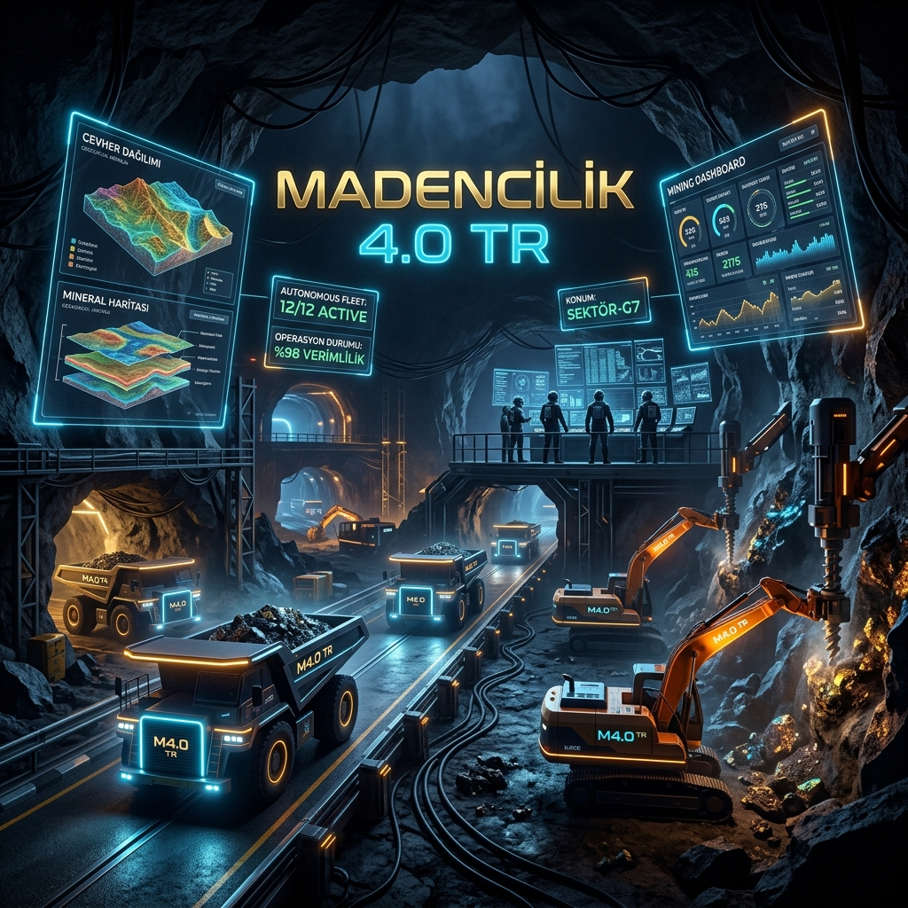

# ⛏️ Madencilik-4.0-TR: Türkiye Maden Araştırmaları ve Strateji Portalı

**Türkiye'nin yer altı zenginliklerini, modern çıkarma yöntemlerini ve madencilik ekonomisini veriye dayalı araştırmalarla inceleyen akademik düzeyde bir "Maden Başarı Manifestosu" ve stratejik dijital külliyat.**

---

## 🎯 Vizyonumuz: Yer Altındaki Güç, Yer Üstündeki Akıl

Madencilik, sadece toprağı kazmak değil; bir milletin teknolojik tam bağımsızlık ve ekonomik şahlanış hikayesidir. **Madencilik-4.0-TR**, Türkiye'nin bu alanda dünyada söz sahibi olması, sadece hammadde ihraç eden bir pazar değil, **maden teknolojilerini ve stratejik analizlerini ihraç eden küresel bir güç olması** vizyonuyla inşa edilmiştir.

Amacımız; jeoloji mühendisliğinden yapay zekaya, maliyet analizinden sürdürülebilirliğe kadar her alanda dünyada 1 numara olma hedefimize ışık tutacak bilimsel bir referans portalı sunmaktır.

---

## 🌍 Küresel Devler: Onlar Nasıl Başardı?

Madencilik teknolojilerinde bugün dünya lideri olan ülkelerin (Avustralya, Kanada, İsveç) başarısı tesadüf değildir. Onlar, "taş devri bitmediği gibi maden devrinin de bitmeyeceğini" erkenden görerek şu adımları attılar:

1.  **Avustralya (Otonomi ve Ölçek):** Devasa sahalarını yönetmek için insan faktörünü minimuma indiren **"Uzaktan Operasyon Merkezleri" (ROC)** kurdular. Yazılım ve robotik şirketlerini maden sahalarının içine gömerek (integrated) bir teknoloji ekosistemi yarattılar.
2.  **Kanada (Akademik Derinlik ve Veri):** Maden arama faaliyetlerinde AI ve uydu verilerini kullanarak "iğneyle kuyu kazma" devrini kapattılar. Akademik bilgiyi doğrudan saha operasyonuna (From Lab to Pit) aktaran devasa kuluçka merkezleri kurdular.
3.  **İsveç (Derinlik ve Enerji Dönüşümü):** Dünyanın en derin ve zorlu madenlerini işletmek zorunda kaldıkları için "imkansızı" başardılar. Bugün yeraltında çalışan elektrikli iş makinelerinin (BEV) ve derin maden tahkimat sistemlerinin küresel standardını onlar belirliyor.

**Ancak bu devlerin zayıf bir noktası var:** Hepsi eski nesil, hantal ve 50 yıllık "legacy" sistemlere bağımlı durumdalar.

---

## 🚀 Biz Nasıl 1 Numara Olacağız? (Stratejik Manifestomuz)

Kuralları onların koyduğu, eski teknolojilere sahip hantal sistemlerle rekabet edemeyiz. **Bizim stratejimiz, oyunu değiştirmektir (Leapfrogging).** Dünyada 1 numara olmak için şu stratejik adımları izleyeceğiz:

### 1. "Bor ve NTE" Kaldıracı (Stratejik Tekel Gücü)
Dünya bor rezervlerinin %73'üne ve dünyanın ikinci büyük NTE (Rare Earth) sahasına sahibiz. Bu sadece bir hammadde üstünlüğü değildir; bu, küresel yeşil dönüşümün (elektrikli araçlar, rüzgar türbinleri, çipler) **vanasını elimizde tutmaktır.** Bu madenleri hammadde olarak değil, **işlenmiş uç ürün teknolojisi** olarak sunduğumuzda kural koyucu biz olacağız.

### 2. "Digital-Native" (Dijital Doğal) Madencilik
Eski sistemleri modernize etmekle vakit kaybetmeyeceğiz. Türkiye'deki yeni keşfedilen sahaları (Elazığ Bakır, Sivas Altın vb.) doğrudan **Madencilik 5.0** (İnsan-Makine iş birliği) ve yerli AI mimarileriyle tasarlayacağız. Bizim madenlerimiz, ilk günden itibaren birer "veri fabrikası" olarak doğacaktır.

### 3. Maliyet Etkin "Sıçrama" Teknolojileri
Geleneksel ve yüksek maliyetli yöntemler yerine; **Bio-leaching (Bakteriyel çözümleme)**, **In-Situ Leaching (Yerinde çözeltme)** ve **XRT Cevher Ayıklama** gibi operasyonel maliyeti (OPEX) radikal şekilde düşüren yöntemlerde dünya lideri AR-GE üssü olacağız.

### 4. Yeşil Madencilik Markası (ESG Advantage)
Dünya artık "kanlı maden" veya "kirli maden" istemiyor. Biz, blokzincir tabanlı takip sistemlerimizle, madenlerimizin her gramının çevreye duyarlı ve etik çıkarıldığını belgeleyerek küresel pazarda **"Yeşil ve Etik Maden"** sertifikasıyla premium bir marka yaratacağız.

---

## 📚 Araştırma ve Müfredat Yapısı

Hedefimize ulaşmak için izlediğimiz teknik ve stratejik araştırma modülleri:

### 🔍 Modül 1: Türkiye Maden Envanteri ve Rezerv Analizi
- **Bölgesel Raporlar:** [Yer altı zenginliklerimizin detaylı dökümü](arastirma-ve-inovasyon/turkiye-maden-envanteri.md).
- **Yeni Keşifler:** [2024-2025 Dönemi Dev Keşif Analizleri](vaka-analizleri/yerel-maden-analizleri.md).
- **Ekonomik Veri:** [Stratejik Maden Fiyat Endeksleri](verisetleri/nadir-toprak-elementleri/nte_fiyat_endeksi.json).

### 🛠️ Modül 2: Maliyet Etkin Çıkarma Teknolojileri
- **Cevher Ayıklama:** XRT ve NIR ile atık yönetimi.
- **Modern Yöntemler:** [ISL, Bio-Leaching ve HPGR Analizleri](teknolojiler/maliyet-etkin-cikarma-yontemleri.md).
- **Robotik ve Otonomi:** Maden sahalarında yerli otonom sistemler.

### 📊 Modül 3: Maden Ekonomisi ve Global Strateji
- **Piyasa Analizi:** [Emtia Süper-Döngüsü ve Türkiye](arastirma-ve-inovasyon/maden-ekonomisi-analizi.md).
- **Yatırım Analizi:** [Maliyet ve ROI Hesaplama Modelleri](maliyet-analizi/yatirim-getiri-analizi.md).
- **Politika:** AB Kritik Hammadde Yasası (CRMA) Uyumu.

### 🚑 Modül 4: İnsan Odaklı Güvenlik (Sıfır Kaza)
- **Yapay Zeka Destekli İSG:** [Kaza Önleme ve Personel Takip Sistemleri](guvenlik-ve-is-sagligi/yapay-zeka-is-sagligi.md).
- **Dönüşüm:** Maden işçisinden "Dijital Operasyon Uzmanı"na yetkinlik geçişi.

---

## 🤝 Katkıda Bulunma (Bilgi Ordusuna Katıl)

Bu portal statik bir döküman değil, yaşayan bir milli araştırma organizmasıdır. Eğer bu devrimin bir parçası olmak istiyorsan:
1.  **Bilgini Paylaş:** Akademik çalışmalarını, saha verilerini veya teknik analizlerini ekle.
2.  **Veriyi Güncelle:** Yeni keşifleri ve küresel fiyat değişimlerini sisteme yansıt.
3.  **Vizyonu Genişlet:** Yeni teknolojik modüller öner ve geliştir.

Katkıda bulunmak için depoyu fork'la, çalışmanı yap ve Pull Request gönder.

---

  <b>Geleceği tahmin etmenin en iyi yolu, onu veriye dayalı stratejilerle inşa etmektir.</b> 
  <i>Türkiye'nin yer altı zenginliklerini, dünyanın en ileri aklıyla buluşturuyoruz.</i>

