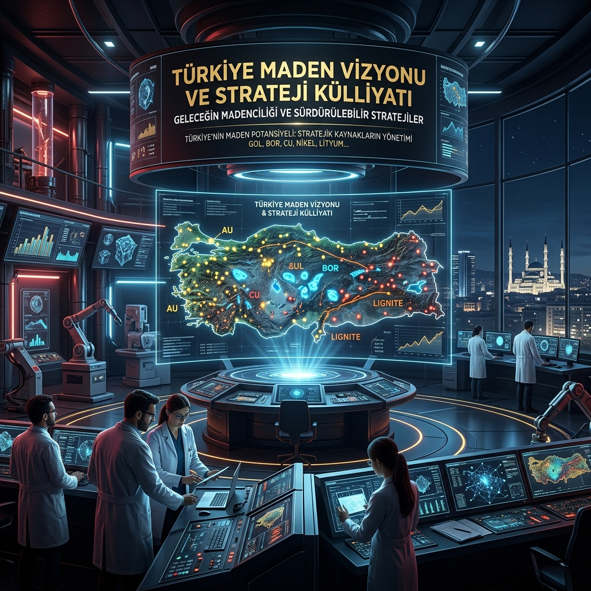

# ⛏️ Türkiye Maden Vizyonu ve Strateji Külliyatı

**Türkiye'nin yer altı zenginliklerini, modern çıkarma yöntemlerini ve madencilik ekonomisini veriye dayalı araştırmalarla inceleyen akademik düzeyde bir "Maden Başarı Manifestosu" ve stratejik dijital külliyat.**

---

## 🎯 Vizyonumuz: Yer Altındaki Güç, Yer Üstündeki Akıl

Madencilik, sadece toprağı kazmak değil; bir milletin teknolojik tam bağımsızlık ve ekonomik şahlanış hikayesidir. **Madencilik-4.0-TR**, Türkiye'nin bu alanda dünyada söz sahibi olması, sadece hammadde ihraç eden bir pazar değil, **maden teknolojilerini ve stratejik analizlerini ihraç eden küresel bir güç olması** vizyonuyla inşa edilmiştir. Bu portal, Türkiye'nin jeopolitik konumunu ve mineral çeşitliliğini, dijital çağın gereksinimleri olan yapay zeka, blokzincir ve robotik sistemlerle birleştirerek yeni bir endüstriyel paradigma inşa etmeyi hedefler.

Amacımız; jeoloji mühendisliğinden yapay zekaya, maliyet analizinden sürdürülebilirliğe kadar her alanda dünyada 1 numara olma hedefimize ışık tutacak bilimsel bir referans portalı sunmaktır. Bu süreçte sadece veriyi toplamakla kalmıyor, o veriyi stratejik birer "karar destek mekanizmasına" dönüştürüyoruz. Yer altındaki sessiz gücü, yer üstündeki kolektif akılla buluşturarak tam bağımsız Türkiye idealine katkı sağlıyoruz.

---

## 🔮 Stratejik Spekülasyon: Anadolu'nun Keşfedilmeyi Bekleyen Söylentileri

Türkiye'nin jeolojik yapısı, sadece bilinen rezervleri değil, teknolojik yetersizlik veya derinlik nedeniyle henüz "resmileşmemiş" devasa bir potansiyeli de barındırmaktadır. Bu bölüm, bilimsel veriler ile stratejik öngörülerin kesiştiği **"Keşif Hipotezlerini"** ve fısıltıdan gerçeğe dönüşen **"Trilyon Dolarlık Gerçekleri"** ele alır:

### 1. "3.5 Trilyon Dolarlık" Saklı Hazine
Sektörel raporlar ve jeolojik projeksiyonlar, Türkiye'nin yer altı kaynaklarının toplam ekonomik değerinin **3.5 Trilyon Dolar** seviyesinde olduğuna işaret etmektedir. Bu sadece bir rakam değil; bor, altın, bakır ve nadir metallerden oluşan devasa bir "Milli Servet" tablosudur. Bugün bu değerin sadece %10'undan azı ekonomiye dahil edilmiş durumdadır. Hedefimiz, "uyuyan" bu 3 trilyon doları Madencilik 4.0 ile uyandırmaktır.

### 2. "Tetis Otobanı" (Tethyan Highway): Madenlerin Kavşak Noktası
Türkiye, dünyanın en zengin metalojenik kuşaklarından biri olan **Tetis (Tethys) Metalojenik Kuşağı**'nın tam kalbinde yer alır. Alp-Himalaya hattı boyunca uzanan bu devasa jeolojik yapı, dünyanın en büyük bakır ve altın yataklarının "otobanı" gibidir. Söylenti değil, jeolojik bir zorunluluk olarak; bu kuşak üzerinde henüz keşfedilmemiş en az **6.500 ton altın** ve on milyonlarca ton bakır yattığı öngörülmektedir.

### 3. "Lityum Vadisi" ve Jeotermal Hazineler
Batı Anadolu'nun jeotermal akışkanlarının içinde, elektrikli araç devrimini besleyecek miktarda **Lityum ve Nadir Metaller** çözünmüş halde bulunmaktadır. Bu sıvı hazinenin, bor atıklarıyla birleştirilerek "Lityum Vadisi" ekosistemine dönüştürülmesi, Türkiye'yi küresel batarya tedarik zincirinin merkezine taşıyacak bir "Süper-Güç" hamlesidir.

### 4. Toroslar'ın Gizli Kritik Metalleri (Nickel & Cobalt)
Toros Dağları'nın bakir bölgelerinde, pil teknolojileri için kritik olan **Kobalt ve Nikel** kuşaklarının henüz haritalanmamış devasa uzantıları olduğu düşünülmektedir. Bu bölgeler, Türkiye'nin "Giga-Fabrikaları" için yerli ham madde üssü olma potansiyeline sahiptir.

### 5. "Mavi Vatan" ve Derin Deniz Hazineleri
Karadeniz ve Doğu Akdeniz'in derin deniz tabanlarında, polimetalik nodüller ve sülfit yatakları olduğuna dair ön veriler, Türkiye'nin maden sınırlarını karadan denizlere taşıyan bir vizyonun parçasıdır. Karadeniz'in oksijensiz derin sularının altında, dokunulmamış bir mineral serveti yattığı teorisi, geleceğin en büyük keşif adaylarından biridir.

---

## ⛓️ Geçmişin Prangaları: "Betonlanan" Kuyular ve Teknolojik Esaret

Türkiye'nin maden ve petrol tarihindeki en büyük tartışma konularından biri, "petrol bulundu ama üstü kapatıldı" veya "kuyulara beton döküldü" söylentileridir. Bu durum, sadece bir şehir efsanesi değil; **teknolojik bağımlılığın ve stratejik vizyonsuzluğun** bir sonucudur:

### 1. "Ekonomik Değil" Denilerek Terk Edilen Gerçekler
1970'li ve 80'li yıllarda, yabancı şirketlerin kontrolündeki aramalarda pek çok kuyu "verimsiz" veya "maliyeti yüksek" denilerek betonlanıp terk edilmiştir. O günün teknolojisi ve düşük petrol fiyatlarıyla (varili 10-20 dolar) "ekonomik olmayan" bu sahalar, bugünün 80-100 dolarlık dünyasında ve modern derin sondaj teknolojileriyle aslında birer servettir. **Gabar ve Cudi** keşifleri, "burada bir şey yok" denilerek üstü kapatılan bölgelerin aslında Türkiye'nin enerji bağımsızlığının anahtarı olduğunu kanıtlamıştır.

### 2. Yabancı Şirketlerin "Stratejik Körlüğü"
Erken dönem aramalarda küresel devler, Türkiye'nin karmaşık jeolojik yapısını çözmek yerine, sadece "en kolay ve en karlı" olanın peşine düşmüşlerdir. Kendi çıkarlarıyla örtüşmeyen, işletilmesi zor veya stratejik olarak Türkiye'yi fazla güçlendirecek sahalar, teknik raporlarda "marjinal" gösterilerek rafa kaldırılmıştır. Bu, bir komplodan ziyade, **yerli ve milli teknolojiye sahip olmamanın** ödediği ağır bir bedeldir.

### 3. Teknolojik Kilitleri Biz Açacağız
"Betonlanan kuyu" efsanelerini bitirmenin tek yolu, başkasının sismik verisine veya başkasının sondaj kulesine muhtaç olmamaktır. Biz, kendi AI algoritmalarımızla yerin altını "şeffaf" hale getirdiğimizde ve kendi derin sondaj filolarımızla (Abdülhamid Han, Fatih, Yavuz) o mühürlü kapıları açtığımızda, Anadolu'nun gerçek serveti gün yüzüne çıkacaktır. **Madencilik 4.0**, bu prangaları kırmak için tasarlanmış dijital bir anahtardır.

---

## 🌍 Küresel Devler: Onlar Nasıl Başardı?

Madencilik teknolojilerinde bugün dünya lideri olan ülkelerin (Avustralya, Kanada, İsveç) başarısı tesadüf değildir. Onlar, "taş devri bitmediği gibi maden devrinin de bitmeyeceğini" erkenden görerek, madenciliği basit bir kazı işlemi değil, bir **"Yüksek Teknoloji Sektörü"** olarak yeniden tanımladılar. Bu ülkeler, devlet teşviklerini doğrudan Ar-Ge ve inovasyona yönlendirerek kendi teknoloji standartlarını dünyaya kabul ettirdiler.

1.  **Avustralya (Otonomi ve Ölçek):** Devasa sahalarını yönetmek için insan faktörünü minimuma indiren **"Uzaktan Operasyon Merkezleri" (ROC)** kurdular. Yazılım ve robotik şirketlerini maden sahalarının içine gömerek (integrated) bir teknoloji ekosistemi yarattılar. Pilbara bölgesindeki sürücüsüz trenler ve kamyonlar, bugün küresel verimlilik standartlarını belirleyen yegane örnektir.
2.  **Kanada (Akademik Derinlik ve Veri):** Maden arama faaliyetlerinde AI ve uydu verilerini kullanarak "iğneyle kuyu kazma" devrini kapattılar. Akademik bilgiyi doğrudan saha operasyonuna (From Lab to Pit) aktaran devasa kuluçka merkezleri kurdular. Toronto Borsası (TSX), dünyadaki "Junior" maden şirketlerinin kalbi haline gelerek, risk sermayesini teknolojik keşiflere yönlendirmeyi başardı.
3.  **İsveç (Derinlik ve Enerji Dönüşümü):** Dünyanın en derin ve zorlu madenlerini işletmek zorunda kaldıkları için "imkansızı" başardılar. Bugün yeraltında çalışan elektrikli iş makinelerinin (BEV) ve derin maden tahkimat sistemlerinin küresel standardını onlar belirliyor. Epiroc ve Sandvik gibi devlerle, madencilik ekipmanları piyasasında sarsılmaz bir tekel oluşturarak teknoloji ihracatında zirveye yerleştiler.

**Ancak bu devlerin zayıf bir noktası var:** Hepsi eski nesil, hantal ve 50 yıllık "legacy" sistemlere bağımlı durumdalar. Bu durum, yeni nesil dijital mimarilere geçişlerinde ciddi bir "teknolojik borç" ve adaptasyon sorunu yaratmaktadır.

---

## 🚀 Biz Nasıl 1 Numara Olacağız? (Stratejik Manifestomuz)

Kuralları onların koyduğu, eski teknolojilere sahip hantal sistemlerle rekabet edemeyiz. **Bizim stratejimiz, oyunu değiştirmektir (Leapfrogging).** Biz, onların on yıllar önce kurduğu hantal altyapılara sahip olmadığımız için, doğrudan en modern sistemleri (Digital-First) inşa etme avantajına sahibiz. Dünyada 1 numara olmak için şu stratejik adımları izleyeceğiz:

### 1. "Bor ve NTE" Kaldıracı (Stratejik Tekel Gücü)
Dünya bor rezervlerinin %73'üne ve dünyanın ikinci büyük NTE (Rare Earth) sahasına sahibiz. Bu sadece bir hammadde üstünlüğü değildir; bu, küresel yeşil dönüşümün (elektrikli araçlar, rüzgar türbinleri, çipler) **vanasını elimizde tutmaktır.** Bu madenleri hammadde olarak değil, **işlenmiş uç ürün teknolojisi** (mıknatıs, batarya hücreleri, bor karbür zırhlar) olarak sunduğumuzda küresel pazarın kural koyucusu biz olacağız. Katma değeri yerinde üreterek ekonomik çarpan etkisini maksimize edeceğiz.

### 2. "Digital-Native" (Dijital Doğal) Madencilik
Eski sistemleri modernize etmekle vakit kaybetmeyeceğiz. Türkiye'deki yeni keşfedilen sahaları (Elazığ Bakır, Sivas Altın vb.) doğrudan **Madencilik 5.0** (İnsan-Makine iş birliği) ve yerli AI mimarileriyle tasarlayacağız. Bizim madenlerimiz, ilk günden itibaren birer "veri fabrikası" olarak doğacaktır. Sensörlerden gelen her veri, gerçek zamanlı olarak dijital ikizlere aktarılacak ve operasyonel kararlar otonom sistemler tarafından optimize edilecektir.

### 3. Maliyet Etkin "Sıçrama" Teknolojileri
Geleneksel ve yüksek maliyetli yöntemler yerine; **Bio-leaching (Bakteriyel çözümleme)**, **In-Situ Leaching (Yerinde çözeltme)** ve **XRT Cevher Ayıklama** gibi operasyonel maliyeti (OPEX) radikal şekilde düşüren yöntemlerde dünya lideri AR-GE üssü olacağız. Bu teknolojiler, düşük tenörlü ve "ekonomik olmayan" sahaları bile karlı hale getirerek rezervlerimizin değerini on katına çıkaracaktır. Enerji verimliliğini merkeze alan bu yöntemlerle, rakiplerimizin enerji maliyetleri altında ezildiği bir dünyada biz rekabet avantajı sağlayacağız.

### 4. Yeşil Madencilik Markası (ESG Advantage)
Dünya artık "kanlı maden" veya "kirli maden" istemiyor; otomotivden elektroniğe her sektör "etik tedarik zinciri" arayışında. Biz, blokzincir tabanlı takip sistemlerimizle, madenlerimizin her gramının çevreye duyarlı ve etik çıkarıldığını belgeleyerek küresel pazarda **"Yeşil ve Etik Maden"** sertifikasıyla premium bir marka yaratacağız. Bu strateji, ürünlerimize sadece ekonomik değil, aynı zamanda ahlaki ve stratejik bir değer de katacaktır.

---

## 📚 Araştırma ve Müfredat Yapısı

Hedefimize ulaşmak için izlediğimiz teknik ve stratejik araştırma modülleri, birbiriyle entegre bir bilgi hiyerarşisi sunar:

### 🔍 Modül 1: Türkiye Maden Envanteri ve Rezerv Analizi
- **Bölgesel Raporlar:** [Yer altı zenginliklerimizin detaylı dökümü](arastirma-ve-inovasyon/turkiye-maden-envanteri.md). Bölgelerimizin jeolojik formasyonlarını ve mineral potansiyellerini akademik verilerle inceliyoruz.
- **Keşif Envanteri:** [Güncel Keşifler ve Potansiyel Sahalar](arastirma-ve-inovasyon/guncel-ve-potansiyel-maden-kesifleri.md). Lityum, Kobalt ve NTE gibi kritik madenlerdeki arama stratejilerimizi ve potansiyel sahaları analiz ediyoruz.
- **Vaka Analizleri:** [2024-2025 Dönemi Dev Keşif Analizleri](vaka-analizleri/yerel-maden-analizleri.md). Elazığ Bakır ve Sivas Altın projeleri üzerinden modern arama başarısını dökümante ediyoruz.

### 🛠️ Modül 2: Maliyet Etkin Çıkarma Teknolojileri
- **Cevher Ayıklama:** [XRT ve Bio-Leaching Teknolojileri Teknik Analizi](teknolojiler/XRT_ve_BioLeaching_Teknik_Analiz.md). Atık yönetimi ve enerji tasarrufu yöntemleri.
- **Modern Yöntemler:** [ISL, Bio-Leaching ve HPGR Analizleri](teknolojiler/maliyet-etkin-cikarma-yontemleri.md). Düşük tenörlü cevherlerin ekonomiye kazandırılması.
- **Robotik ve Otonomi:** Maden sahalarında yerli otonom sistemlerin (İHA, Sürü Robotlar) kullanımı.

### 📊 Modül 3: Maden Ekonomisi ve Global Strateji
- **Potansiyel Analizi:** [3.5 Trilyon Dolarlık Kaynak Hesaplama Modeli](maliyet-analizi/trilyon-dolarlik-potansiyel-hesaplama.md). Milli servetin finansal dökümü ve çarpan etkisi.
- **Piyasa Analizi:** [Emtia Süper-Döngüsü ve Türkiye](arastirma-ve-inovasyon/maden-ekonomisi-analizi.md). Küresel piyasalardaki arz-talep dengeleri.
- **Yatırım Analizi:** [ROI Hesaplama Modelleri](maliyet-analizi/yatirim-getiri-analizi.md). Teknolojik yatırımların finansal geri dönüşleri.
- **Politika:** AB Kritik Hammadde Yasası (CRMA) ve küresel regülasyonların Türkiye madenciliğine etkileri üzerine stratejik incelemeler.

### 🚑 Modül 4: İnsan Odaklı Güvenlik (Sıfır Kaza)
- **Yapay Zeka Destekli İSG:** [Kaza Önleme Sistemleri](guvenlik-ve-is-sagligi/yapay-zeka-is-sagligi.md). Sensör verileriyle iş sağlığı ve güvenliğini proaktif bir sürece dönüştürüyoruz.
- **Dönüşüm:** Maden işçisinden "Dijital Operasyon Uzmanı"na yetkinlik geçişi. Geleceğin madencisini, veriyi okuyan ve otonom sistemleri yöneten bir profil olarak yeniden tanımlıyoruz.

### 🛰️ Modül 5: Yeni Nesil Maden Arama (Exploration)
- **Teknoloji:** [AI, Hiperspektral ve Metagenomik Keşif](arastirma-ve-inovasyon/yeni-nesil-maden-arama.md). Geleneksel yöntemlerin bittiği yerde başlayan uç teknolojilerle "derin keşif" vizyonu.
- **Veri Gölü:** Türkiye'nin tüm jeolojik verilerini yapay zeka için bir "öğrenme havuzu" olarak kullanma stratejisi.

---

## 🔭 Sektörel Görünüm 2025-2030 Projeksiyonu

Türkiye madencilik sektörü, önümüzdeki 5 yıl içinde basit bir hammadde sağlayıcısından, **"Teknoloji ve Rafinasyon Merkezi"**ne dönüşecektir. Bu dönüşümün ana motorları; Bor ve NTE'deki uç ürün tesisleri, batarya teknolojileri için lityum arzı ve derin madenlerdeki yerli otonom sistemler olacaktır. Küresel yeşil dönüşümün (Green Deal) baskısı, bizim için bir engel değil, "Yeşil Madencilik" vizyonumuzla küresel pazarda liderliğe giden bir sıçrama tahtasıdır.

---

## 🤝 Katkıda Bulunma (Bilgi Ordusuna Katıl)

Bu portal statik bir döküman değil, yaşayan bir milli araştırma organizmasıdır. Biz, bilginin paylaşıldıkça büyüyeceğine ve Türkiye'nin ancak ortak bir akıl ile 1 numara olabileceğine inanıyoruz. Eğer bu devrimin bir parçası olmak istiyorsan:
1.  **Bilgini Paylaş:** Akademik çalışmalarını, saha verilerini veya teknik analizlerini külliyatımıza ekle.
2.  **Veriyi Güncelle:** Yeni keşifleri, küresel fiyat değişimlerini ve teknolojik güncellemeleri sisteme yansıt.
3.  **Vizyonu Genişlet:** Henüz ele almadığımız teknolojik modüller öner ve bu modüllerin araştırma liderliğini üstlen.

Katkıda bulunmak için depoyu fork'la, çalışmanı yap ve Pull Request gönder. Unutma, bu sadece bir kod reposu değil, Türkiye'nin maden geleceğinin haritasıdır.

---

## ❓ Sıkça Sorulan Sorular (SSS)

**S: Veriler hangi kaynaklara dayanmaktadır?**
C: İçerikler; MTA, MAPEG, USGS ve ilgili şirketlerin (Eti Maden, Eti Bakır, Ermaden vb.) resmi raporları ile uluslararası akademik literatür taramalarına dayanmaktadır. Verilerimiz periyodik olarak güncellenir.

**S: İçeriği ticari veya akademik projelerimde kullanabilir miyim?**
C: Evet, projemiz MIT Lisansı altındadır. Kaynak göstererek (Atıf yaparak) bu külliyatı dilediğiniz gibi kullanabilir, projelerinizde bir temel olarak alabilirsiniz.

---

## 📜 Lisans ve Atıf

Bu proje [MIT Lisansı](LICENSE) ile korunmaktadır. Akademik çalışmalarınızda aşağıdaki şekilde atıf yapabilirsiniz:

> *Madencilik-4.0-TR (2025). Türkiye Maden Envanteri ve Maliyet Etkin Çıkarma Teknolojileri Araştırma Portalı.*

---

  <b>Geleceği tahmin etmenin en iyi yolu, onu veriye dayalı stratejilerle inşa etmektir.</b> 
  <i>Türkiye'nin yer altı zenginliklerini, dünyanın en ileri aklıyla buluşturuyoruz.</i>

