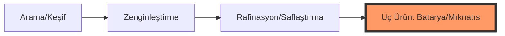

# Türkiye Güncel ve Potansiyel Maden Envanteri Raporu (2024-2025)

Bu rapor, Türkiye'nin halihazırda keşfettiği ve işletmeye başladığı maden yatakları ile jeolojik veriler ışığında keşfedilmesi muhtemel "kritik ve stratejik" sahaları analiz etmektedir.

---

## 1. Güncel Keşifler ve İşletilen Büyük Rezervler

Aşağıdaki sahalar, Türkiye'nin madencilik ekonomisinin omurgasını oluşturan ve son dönemde keşfedilerek envantere dahil edilen projelerdir:

| Maden | Ana Lokasyonlar | Durum / Önem |
|:---|:---|:---|
| **Bor (B)** | Eskişehir (Kırka), Kütahya (Emet), Balıkesir | Dünya rezervinin %73'ü. Uç ürün (Bor Karbür) üretimi başladı. |
| **Altın (Au)** | Uşak (Kışladağ), Erzincan (Çöpler), Bilecik (Söğüt), Sivas (Kangal) | Bilecik ve Sivas keşifleri yıllık üretim kapasitesini 50 ton üzerine taşıyacak. |
| **Bakır (Cu)** | Elazığ (Maden), Artvin (Murgul), Kastamonu (Küre) | Elazığ keşfi (35M ton cevher) Türkiye'nin bakır ithalatını radikal azaltacak. |
| **Nadir Toprak (NTE)** | Eskişehir (Beylikova) | 694 Milyon Ton kaynak. Pilot tesis devrede, endüstriyel tesis 2027 planında. |
| **Trona (Doğal Soda)** | Ankara (Beypazarı, Kazan) | Dünyanın en büyük doğal soda külü yataklarından biri. |

---

## 2. Keşfedilmesi Muhtemel ve Kritik Potansiyel Sahalar

Türkiye'nin "Kritik Madenler Stratejisi" kapsamında arama ve geliştirme faaliyetlerinin odaklandığı, yüksek potansiyel barındıran madenler ve bölgeler:

### 2.1 Lityum (Li) - Enerji Depolama Anahtarı
- **Potansiyel:** Bor atıklarından üretim (Kırka ve Emet) hali hazırda başladı. Asıl büyük keşif potansiyeli **Aydın ve Denizli** bölgelerindeki jeotermal kaynak sularında bulunmaktadır.
- **Hedef:** Türkiye'nin batarya üretim üssü (Togg, Aspilsan) olması için yerli lityum arzı kritik.

### 2.2 Nadir Toprak Elementleri (Yeni Sahalar)
Beylikova dışındaki NTE potansiyeli şu bölgelerde araştırılmaktadır:
- **Sivas (Yıldızeli, Hafik)**
- **Kayseri (Özvatan)**
- **Bursa (Büyükorhan)**
- **Çanakkale (Ayvacık)**

### 2.3 Kobalt (Co) ve Grafit (C)
- **Kobalt:** Elazığ ve Balıkesir'deki nikel ve bakır yataklarının yan ürünü olarak yüksek potansiyel taşımaktadır.
- **Grafit:** Kütahya ve Kastamonu bölgelerinde pil sınıfı (battery grade) grafit potansiyeli üzerine çalışmalar yoğunlaşmıştır.

### 2.4 Titanyum (Ti) ve Magnezyum (Mg)
- **Titanyum:** Manisa ve Aydın illerindeki rutil ve ilmenit yatakları savunma sanayii için stratejik hedef.
- **Magnezyum:** Türkiye'nin zengin manyezit yataklarından (Eskişehir, Kütahya) metal magnezyum üretimi yüksek potansiyelli bir alandır.

### 2.5 Gizli Kritik Metaller (Galyum, Germanyum, İndiyum)
Bu madenler genellikle bağımsız yataklar yerine diğer metallerin içinde bulunur:
- **Potansiyel:** Çinko ve Boksit (Alüminyum) tesislerindeki atıklardan geri kazanım potansiyeli araştırılmaktadır.

---

## 3. Stratejik Yol Haritası: Keşiften Katma Değere

Türkiye'nin bu madenlerdeki nihai hedefi sadece "bulmak" değil, **"saflaştırmak ve teknolojiye dönüştürmek"**tir:

---
**Kaynaklar:**
- Enerji ve Tabii Kaynaklar Bakanlığı, Kritik Madenler Listesi (2024).
- Eti Maden ve MTA Genel Müdürlüğü Faaliyet Raporları.
- TENMAK (Türkiye Enerji, Nükleer ve Maden Araştırma Kurumu) NTE Raporu.
