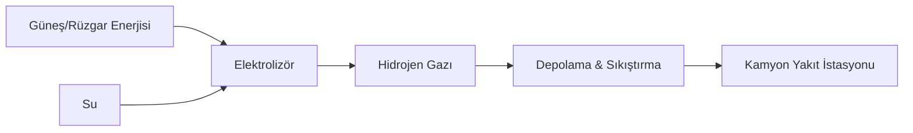

# Hidrojen Yakıtlı Maden Filoları ve Dekarbonizasyon

Madencilik operasyonlarında karbon ayak izinin %40 ila %60'ı ağır hizmet tipi kamyonlardan (Haul Trucks) kaynaklanmaktadır. Madencilik-4.0 vizyonu, bu emisyonu sıfırlamak için **Yeşil Hidrojen** teknolojisini önermektedir.

---

## 1. Neden Hidrojen? (FCEV vs BEV)

Büyük maden kamyonları (290+ ton kapasiteli) için sadece bataryalı (Battery Electric Vehicle - BEV) sistemler, batarya ağırlığı ve şarj süresi nedeniyle kısıtlıdır. Hidrojen Yakıt Hücreli Araçlar (FCEV) ise şu avantajları sunar:

- **Hızlı Yakıt İkmali:** Dizel kamyonlara benzer sürelerde (15-20 dk) yakıt dolumu.
- **Yüksek Enerji Yoğunluğu:** Uzun çalışma süreleri ve ağır yükler için ideal güç çıkışı.
- **Sıfır Emisyon:** Egzozdan sadece saf su buharı salınımı.

## 2. Teknik Mimari

Hidrojen yakıtlı bir maden kamyonu şu bileşenlerden oluşur:

1.  **Hidrojen Tankları:** 350-700 bar basınçta depolama.
2.  **Yakıt Hücresi Yığını (Fuel Cell Stack):** Hidrojen ve oksijeni birleştirerek elektrik üretir.
3.  **Lityum-İyon Batarya:** Rejeneratif frenlemeden gelen enerjiyi depolar ve ani güç ihtiyaçlarını karşılar.
4.  **Elektrik Motorları:** Tekerleklere tork iletir.

## 3. Yerinde Üretim (On-site Hydrogen Generation)

Maden sahasında yeşil hidrojen üretimi, lojistik maliyetleri ortadan kaldırır:

## 4. Küresel Uygulama Örnekleri

- **Anglo American (Mogalakwena Madeni):** Dünyanın ilk hidrojen yakıtlı dev maden kamyonu projesi (nuGen™).
- **Fortescue Future Industries:** Hidrojen yakıtlı tren ve kamyon prototipleri üzerine yatırımlar.

## 5. Türkiye Potansiyeli

Türkiye'nin yüksek güneş ve rüzgar enerjisi kapasitesi, maden sahalarında "Yeşil Hidrojen Hub"ları kurulması için eşsiz bir fırsat sunmaktadır. Özellikle Bor maden sahalarında bu teknolojinin kullanılması, **"Yeşil Bor"** markasının küresel değerini artıracaktır.

---

## Referanslar

- International Energy Agency (IEA), Hydrogen in Heavy Industry (2024).
- Anglo American nuGen Hydrogen Haulage Project Report.
- Madencilik-4.0-TR Sürdürülebilirlik Raporları.
